# Hi 👋, I'm Rahul Tayal

## 🚀 About Me

Engineer & builder — I design **real-time Voice AI systems** and the backends that keep them alive in production at enterprise scale.

- 🎙️ Architected voice bot backends serving **3M+ voice-AI minutes every month** across enterprise deployments
- 🤝 Worked as a **Forward Deployed Engineer (FDE)** — embedded with major enterprise clients, shipping an inbound Voice AI system handling **50K+ leads/day** with seamless live call transfer
- 🤖 Engineered Voice AI that **passed the Turing Test** in real customer conversations — tuned latency, turn-taking, and conversational realism
- ✍️ I write about voice AI and backend engineering on **[Substack](https://rtayal.substack.com)**

## 🛠️ Tech Stack

 

## 📊 GitHub Stats

<picture>
  <source media="(prefers-color-scheme: dark)" srcset="assets/overview-dark.svg">
  
</picture>

  

<picture>
  <source media="(prefers-color-scheme: dark)" srcset="assets/activity-dark.svg">
  
</picture>

## 🏆 Achievements

| | |
|---|---|
| 🤖 **Voice AI Turing Test** | Engineered Voice AI that passed the Turing Test in real customer scenarios |
| 🏅 **2× Top Performer of the Quarter** | Recognized twice for exceptional impact |
| 🔥 **On-call record** | 186 tickets resolved in 2 weeks during high-severity production incidents |
| 🥇 **Gold Medalist** | B.Tech Computer Science, DIT University — CGPA 9.6 |

## 📫 Connect

<a href="mailto:rahultayal816@gmail.com"><picture><source media="(prefers-color-scheme: dark)" srcset="assets/connect-gmail-dark.svg"></picture></a>&nbsp;
<a href="https://www.linkedin.com/in/rahul-tayal-007467197"><picture><source media="(prefers-color-scheme: dark)" srcset="assets/connect-linkedin-dark.svg"></picture></a>&nbsp;
<a href="https://x.com/its_tayal"><picture><source media="(prefers-color-scheme: dark)" srcset="assets/connect-x-dark.svg"></picture></a>&nbsp;
<a href="https://rtayal.substack.com"><picture><source media="(prefers-color-scheme: dark)" srcset="assets/connect-substack-dark.svg"></picture></a>

